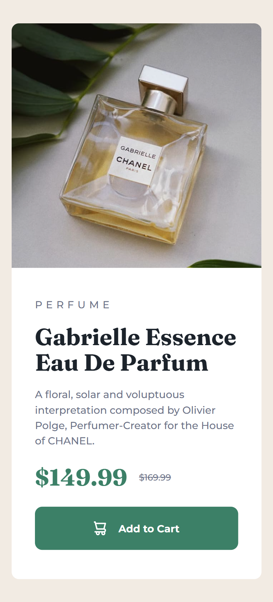

# Frontend Mentor - Product preview card component solution

This is a solution to the [Product preview card component challenge on Frontend Mentor](https://www.frontendmentor.io/challenges/product-preview-card-component-GO7UmttRfa). Frontend Mentor challenges help you improve your coding skills by building realistic projects.

## Table of contents

- [Overview](#overview)
  - [The challenge](#the-challenge)
  - [Screenshot](#screenshot)
  - [Links](#links)
- [My process](#my-process)
  - [Built with](#built-with)
  - [What I learned](#what-i-learned)
  - [Continued development](#continued-development)

## Overview

### The challenge

Users should be able to:

- View the optimal layout depending on their device's screen size
- See hover and focus states for interactive elements

### Screenshot

### Links

- Solution URL: [https://mettyoutan.github.io/frontend-mentor-product-preview-card/](https://mettyoutan.github.io/frontend-mentor-product-preview-card/)
- Live Site URL: [https://mettyoutan.github.io/frontend-mentor-product-preview-card/](https://mettyoutan.github.io/frontend-mentor-product-preview-card/)

## My process

### Built with

- Semantic HTML5 markup
- CSS custom properties
- Flexbox
- CSS Grid
- Mobile-first workflow

### What I learned

From this project, I learned how to use some css properties which help me achieve responsive website layout, such as min(), clamp(), and media query. So, right now I can confidently build a responsive web. Also, tbh it's my first time using grid instead of flex, which from what I see is more simpler for this case.

### Continued development

I hope that I can build more complex responsive website, which will boost my confidence.
